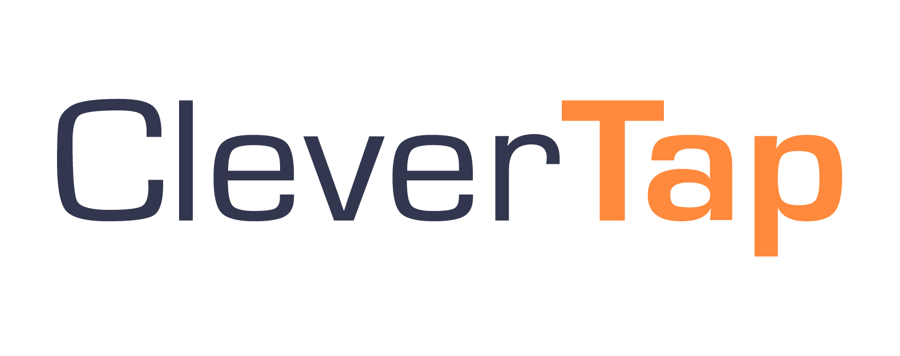

<p align="center">
  
</p>

# CleverTap Cordova Plugin

[](https://badge.fury.io/js/clevertap-cordova)
<a href="https://github.com/CleverTap/clevertap-cordova/releases">
    
</a>
[](https://www.npmjs.com/package/clevertap-cordova)

## 👋 Introduction
The CleverTap Cordova Plugin for Mobile Customer Engagement and Analytics solutions.

For more information check out our [website](https://clevertap.com/ "CleverTap") and [documentation](https://developer.clevertap.com/docs/ "CleverTap Technical Documentation").

To get started, sign up [here](https://clevertap.com/live-product-demo/).

## ✅ Supported Versions

- [CleverTap Android SDK version 4.0.2](https://github.com/CleverTap/clevertap-android-sdk/releases/tag/core-v4.0.2)
- [CleverTap iOS SDK version 3.9.2](https://github.com/CleverTap/clevertap-ios-sdk/releases/tag/3.9.2)

## 🚀 Install

To install CleverTap for Cordova, follow the 3 steps mentioned below:

### 1️⃣ Sign up

[Sign up](https://clevertap.com/live-product-demo/) for a free account.  

When you create your CleverTap account, you will also automatically get a -Test account.  Use the -Test account for development and the main account for production.

#### Install the Plugin

Grab the Account ID and Token values from your CleverTap [Dashboard](https://dashboard.clevertap.com) -> Settings.

##### For Android *Important*
Starting with v2.0.0, the plugin uses FCM rather than GCM.  To configure FCM, add your google-services.json to the root of your cordova project **before you add the plugin**.  
The plugin uses an `after plugin add` hook script to configure your project for FCM.  
If the google-services.json file is not present in your project when the script runs, FCM will not be configured properly and will not work.

##### Using Cordova  

```sh
# ensure npm is installed: npm -g install npm
cordova plugin add https://github.com/CleverTap/clevertap-cordova.git --variable CLEVERTAP_ACCOUNT_ID="YOUR CLEVERTAP ACCOUNT ID" --variable CLEVERTAP_TOKEN="YOUR CELVERTAP ACCOUNT TOKEN"
```

##### Using Ionic  

```sh
ionic cordova plugin add clevertap-cordova@latest --variable CLEVERTAP_ACCOUNT_ID="YOUR CLEVERTAP ACCOUNT ID" --variable CLEVERTAP_TOKEN="YOUR CELVERTAP ACCOUNT TOKEN"
```

##### For Ionic 5
```sh
npm install @ionic-native/clevertap --save 
```
- [See the included Ionic 5 Example project for usage](/Samples/IonicCordova/IonicCordovaAngularProject/src/app/app.component.ts).

- Be sure to [add CleverTap as a provider in your app module](/Samples/IonicCordova/IonicCordovaAngularProject/src/app/app.module.ts). 
```javascript
  constructor(platform: Platform, statusBar: StatusBar, splashScreen: SplashScreen, clevertap: CleverTap) {
    platform.ready().then(() => {
      // Okay, so the platform is ready and our plugins are available.
      // Here you can do any higher level native things you might need.
      statusBar.styleDefault();
      splashScreen.hide();

      ...
      clevertap.setDebugLevel(2);
      clevertap.profileGetCleverTapID((id) => {console.log(id)});
      ...
    });
  }
}

```

#### Android

Check that the following is inside the `<application></application>` tags of your AndroidManifest.xml:  

```xml
    <meta-data  
        android:name="CLEVERTAP_ACCOUNT_ID"  
        android:value="Your CleverTap Account ID"/>  
    <meta-data  
        android:name="CLEVERTAP_TOKEN"  
        android:value="Your CleverTap Account Token"/>
```

Replace "Your CleverTap Account ID" and "Your CleverTap Account Token" with actual values from your CleverTap [Dashboard](https://dashboard.clevertap.com) -> Settings.

**Set the Lifecycle Callback**

IMPORTANT!

Check the `android:name` property of the `<application>` tag of our AndroidManifest.xml:

```xml
    <application
        android:name="com.clevertap.android.sdk.Application">
```

**Note:** The above step is **extremely important** and enables CleverTap to track notification opens, display in-app notifications, track deep links, and other important **user behaviour**.

**Add Permissions**

Please ensure that you're requesting the following permissions for your app:

```xml
    <!-- Required to allow the app to send events -->
    <uses-permission android:name="android.permission.INTERNET"/>
    <!-- Recommended so that we can be smart about when to send the data -->
    <uses-permission android:name="android.permission.ACCESS_NETWORK_STATE"/>
    <uses-permission android:name="android.permission.WAKE_LOCK" />
```

[Please see the example AndroidManifest.xml here](https://github.com/CleverTap/clevertap-cordova/blob/master/ExampleProject/platforms/android/app/src/main/AndroidManifest.xml).

**Add Dependencies**

Make sure your build.gradle file includes the play-services and support library dependencies:

```groovy
    dependencies {
        implementation fileTree(dir: 'libs', include: '*.jar'  )
        debugCompile(project(path: "CordovaLib", configuration: "debug"))
        releaseCompile(project(path: "CordovaLib", configuration: "release"))
        // SUB-PROJECT DEPENDENCIES START
        implementation "com.google.firebase:firebase-core:+"
        implementation "com.google.firebase:firebase-messaging:20.2.4"
        implementation 'androidx.core:core:1.3.0'
        implementation 'androidx.fragment:fragment:1.1.0'
        implementation "com.android.installreferrer:installreferrer:2.1" //Mandatory for v2.1.8 and above
        //MANDATORY for App Inbox
        implementation 'androidx.appcompat:appcompat:1.2.0'
        implementation 'androidx.recyclerview:recyclerview:1.1.0'
        implementation 'androidx.viewpager:viewpager:1.0.0'
        implementation 'com.google.android.material:material:1.2.1'
        implementation 'com.github.bumptech.glide:glide:4.11.0'
        //Optional ExoPlayer Libraries for Audio/Video Inbox Messages. Audio/Video messages will be dropped without these dependencies
        implementation 'com.google.android.exoplayer:exoplayer:2.11.5'
        implementation 'com.google.android.exoplayer:exoplayer-hls:2.11.5'
        implementation 'com.google.android.exoplayer:exoplayer-ui:2.11.5'
        // SUB-PROJECT DEPENDENCIES END 
```  

#### Support AndroidX

To support AndroidX libraries, add the following to your `config.xml` file -

```xml
    <preference name="AndroidXEnabled" value="true" />
```

Also ensure that your app supports `cordova-android@9.0.0`

### 2️⃣ Set up and register for push notifications and deep links

#### iOS

[Set up push notifications for your app](https://developer.apple.com/library/mac/documentation/IDEs/Conceptual/AppDistributionGuide/AddingCapabilities/AddingCapabilities.html#//apple_ref/doc/uid/TP40012582-CH26-SW6).

If you plan on using deep links, [please register your custom url scheme as described here](https://developer.apple.com/library/ios/documentation/iPhone/Conceptual/iPhoneOSProgrammingGuide/Inter-AppCommunication/Inter-AppCommunication.html#//apple_ref/doc/uid/TP40007072-CH6-SW1).

Call the following from your Javascript.

```javascript
    CleverTap.registerPush();
```

#### Android

The `FCMTokenListenerService` of the CleverTap Android SDK registers push tokens automatically. No action is required from the Javascript side. Hence, Android does not require the `CleverTap.registerPush()` method.

Add your custom url scheme to the AndroidManifest.xml.

```xml
	 <intent-filter android:label="@string/app_name">
                <action android:name="android.intent.action.VIEW" />
                <category android:name="android.intent.category.DEFAULT" />
                <category android:name="android.intent.category.BROWSABLE" />
                <data android:scheme="clevertapstarter" />
     </intent-filter>
```

See [example AndroidManifest.xml](ihttps://github.com/CleverTap/clevertap-cordova/blob/master/ExampleProject/platforms/android/app/src/main/AndroidManifest.xml).

### 3️⃣ Integrate Javascript with the Plugin

After integrating, all calls to the CleverTap SDK should be made from your Javascript.

Start by adding the following listeners to your Javascript:

```javascript
    document.addEventListener('deviceready', this.onDeviceReady, false);
    document.addEventListener('onCleverTapProfileSync', this.onCleverTapProfileSync, false); // optional: to be notified of CleverTap user profile synchronization updates
    document.addEventListener('onCleverTapProfileDidInitialize', this.onCleverTapProfileDidInitialize, false); // optional, to be notified when the CleverTap user profile is initialized
    document.addEventListener('onCleverTapInAppNotificationDismissed', this.onCleverTapInAppNotificationDismissed, false); // optional, to be receive a callback with custom in-app notification click data
    document.addEventListener('onDeepLink', this.onDeepLink, false); // optional, register to receive deep links.
    document.addEventListener('onPushNotification', this.onPushNotification, false); // optional, register to receive push notification payloads.
    document.addEventListener('onCleverTapInboxDidInitialize', this.onCleverTapInboxDidInitialize, false); // optional, to check if CleverTap Inbox intialized
    document.addEventListener('onCleverTapInboxMessagesDidUpdate', this.onCleverTapInboxMessagesDidUpdate, false); // optional, to check if CleverTap Inbox Messages were updated
    document.addEventListener('onCleverTapInboxButtonClick', this.onCleverTapInboxButtonClick, false); // optional, to check if Inbox button was clicked with custom payload
    document.addEventListener('onCleverTapInAppButtonClick', this.onCleverTapInAppButtonClick, false); // optional, to check if InApp button was clicked with custom payload
    document.addEventListener('onCleverTapFeatureFlagsDidUpdate', this.onCleverTapFeatureFlagsDidUpdate, false); // optional, to check if Feature Flags were updated
    document.addEventListener('onCleverTapProductConfigDidInitialize', this.onCleverTapProductConfigDidInitialize, false); // optional, to check if Product Config was initialized
    document.addEventListener('onCleverTapProductConfigDidFetch', this.onCleverTapProductConfigDidFetch, false); // optional, to check if Product Configs were updated
    document.addEventListener('onCleverTapProductConfigDidActivate', this.onCleverTapProductConfigDidActivate, false); // optional, to check if Product Configs were activated
    document.addEventListener('onCleverTapExperimentsUpdated', this.onCleverTapExperimentsUpdated, false); // optional, to check if Dynamic Variable Experiments were updated
    document.addEventListener('onCleverTapDisplayUnitsLoaded', this.onCleverTapDisplayUnitsLoaded, false); // optional, to check if Native Display units were loaded


    // deep link handling  
    onDeepLink: function(e) {
        console.log(e.deeplink);  
    },

    // push notification data handling
    onPushNotification: function(e) {
        console.log(JSON.stringify(e.notification));
    },
    onCleverTapInboxDidInitialize: function() {
        CleverTap.showInbox({"navBarTitle":"My App Inbox","tabs": ["tag1", "tag2"],"navBarColor":"#FF0000"});
    },
    
    onCleverTapInboxMessagesDidUpdate: function() {
        CleverTap.getInboxMessageUnreadCount(function(val) {console.log("Inbox unread message count"+val);})
        CleverTap.getInboxMessageCount(function(val) {console.log("Inbox read message count"+val);});
    },

    onCleverTapInAppButtonClick: function(e) {
        console.log("onCleverTapInAppButtonClick");
        console.log(e.customExtras);
    },

    onCleverTapInboxButtonClick: function(e) {
        console.log("onCleverTapInboxButtonClick");
        console.log(e.customExtras);
    },

    onCleverTapFeatureFlagsDidUpdate: function() {
        console.log("onCleverTapFeatureFlagsDidUpdate");
    },

    onCleverTapProductConfigDidInitialize: function() {
        console.log("onCleverTapProductConfigDidInitialize");
    },

    onCleverTapProductConfigDidFetch: function() {
        console.log("onCleverTapProductConfigDidFetch");
    },

    onCleverTapProductConfigDidActivate: function() {
        console.log("onCleverTapProductConfigDidActivate");
    },

    onCleverTapExperimentsUpdated: function() {
        console.log("onCleverTapExperimentsUpdated");
    },

    onCleverTapDisplayUnitsLoaded: function(e) {
        console.log("onCleverTapDisplayUnitsLoaded");
        console.log(e.units);
    },
```


Then:  

- [See the included Example Cordova project for usage](/Samples/Cordova/ExampleProject/www/js/index.js).  

- [See the included Ionic Example project for usage](/Samples/IonicCordova/IonicCordovaAngularProject/src/app/app.component.ts).

## ⁉️ Questions? #

 If you have questions or concerns, you can reach out to the CleverTap support team from the CleverTap Dashboard. 
 
**TroubleShooting Guide:** Please refer [here](docs/Troubleshooting-Guide.md) if you are facing common integration issues.
